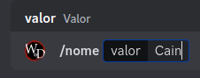
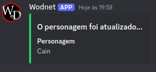
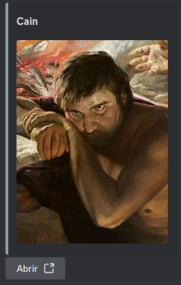
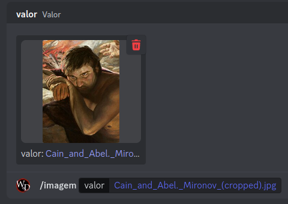

# Tutorial de Uso do Bot Wodnet no Discord

Bem-vindo ao guia de uso do Wodnet! Este bot foi projetado para facilitar sua experiência no Discord, fornecendo ferramentas úteis e comandos para personalizar e melhorar o gerenciamento do seu servidor.

---

## Sumário

1. [Adicionando o Bot Wodnet ao Servidor](#adicionando-o-bot-wodnet-ao-servidor)
2. [Comandos Básicos](#comandos-básicos)
3. [Dicas e Solução de Problemas](#dicas-e-solução-de-problemas)

---

## Adicionando o Bot Wodnet ao Servidor

1. **Obtenha o link de convite do Wodnet**: O link de convite pode ser encontrado no site oficial ou em [\[link do convite\]](https://discord.com/oauth2/authorize?client_id=584804926488707083&permissions=8&scope=bot%20applications.commands).
2. **Autorize o bot**:
   - Clique no link de convite.
   - Escolha o servidor onde deseja adicionar o bot.
   - Conceda as permissões necessárias.
   - Clique em **Autorizar**.
3. Verifique se o bot foi adicionado ao servidor. Ele deve aparecer na lista de membros.

---

## Comandos Básicos

- **Mudar o nome do personagem**:

  

  Atualiza o nome do personagem.

  

- **Gerar o link da ficha do personagem**:

  

  Gera um link com a ficha do personagem cadastrado.

  

  O Wodnet vai enviar o link da sua ficha na sua caixa privada.

  

  Sua ficha online vai ser assim.

  

- **Mudar a imagem do personagem**:

  

  Atualiza a imagem do personagem.

---

## Dicas e Solução de Problemas

1. **O bot não responde aos comandos:**
   - Abra o link de inicialização do Wodnet

\s(●?●?●?●?●)\}\s(\[.*\])(\s.*)"

---

Com esses passos, você está pronto para aproveitar ao máximo o Wodnet no seu servidor Discord! Caso tenha dúvidas ou precise de suporte adicional, consulte a documentação oficial ou entre em contato com a equipe de suporte do bot.